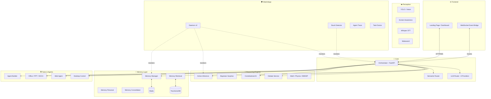

<div align="center">

#  XOYO Omega

**An Autonomous AI Operating System**

[](https://python.org)
[](https://fastapi.tiangolo.com)
[](https://redis.io)
[](LICENSE)

*35+ neural microservices orchestrated into a single, self-healing, autonomous AI system that can reason, perceive, remember, speak, and act on your computer.*

[Features](#-features) · [Architecture](#%EF%B8%8F-architecture) · [Quick Start](#-quick-start) · [Services](#-service-catalog) · [License](#-license)

</div>

---

## 🌟 What is XOYO?

XOYO Omega is not a chatbot — it is a **full-stack autonomous AI operating system** designed to run locally on commodity hardware (tested on 8GB RAM, Intel i3-1115G4). It orchestrates 35+ specialized neural services into one cohesive agent that can:

- **Think**: Multi-provider LLM routing across 8+ providers (Groq, Cerebras, Mistral, NVIDIA NIM, OpenRouter, Cloudflare, SiliconFlow, Ollama) with zero-failure cascading fallback.
- **Remember**: Hierarchical memory system with episodic recall, semantic retrieval, personal context, and automatic consolidation.
- **Reason**: Active Inference, Bayesian Surprise detection, Constitutional AI safety guardrails, and multi-agent debate for complex decisions.
- **Perceive**: Computer vision (YOLO, Florence, DINO), screen awareness, wakeword detection, and Whisper STT.
- **Speak**: Neural TTS with prosody control and a full voice pipeline.
- **Act**: Desktop control, web browsing agent, Google integration, document/presentation generation, and autonomous code writing.
- **Self-Heal**: Watchdog daemon with automatic crash recovery, stuck-task detection, and metacognitive tracing.

---

## ✨ Features

| Category | Capabilities |
|---|---|
| **🧠 Intelligence** | Multi-provider LLM Router (8 providers, cascading fallback), Task-aware model selection, Semantic routing |
| **💾 Memory** | Episodic memory, Semantic retrieval (vector DB), Personal context, Automatic consolidation, Memory crystallization |
| **🔬 Reasoning** | Active Inference engine, Bayesian Surprise detection, Multi-agent debate, BMSSP solver, Physics/Math services |
| **👁️ Perception** | YOLO object detection, Florence/DINO vision, Screen awareness, Wakeword detection, Whisper STT |
| **🗣️ Voice** | Neural TTS, Prosody control, Voice pipeline, Progress vocalization |
| **🛠️ Tools** | Desktop control, Web/Google agents, Office agent, PPT/DOCX generation, Image generation, Scene creation |
| **🛡️ Safety** | Constitutional AI guardrails, Flow policy engine, Intent classification (BNN), Permission system (VMAO) |
| **🔄 Self-Healing** | Watchdog daemon, Stuck detector, Agent trace, Task doctor, Interrupt FSM, Auto-restart (3x retry) |

---

## 🏗️ Architecture



---

## 🚀 Quick Start

### Prerequisites

- **Python 3.10+**
- **Redis** (for inter-service communication and memory)
- **8GB+ RAM** (Lite Mode auto-disables heavy ML services on constrained systems)

### Installation

```bash
# Clone the repository
git clone https://github.com/shashankrpatil077-ctrl/xoyo.git
cd xoyo

# Create virtual environment
python3 -m venv venv
source venv/bin/activate

# Install dependencies
pip install -r requirements.txt

# Configure environment
cp .env.example .env
# Edit .env with your API keys (Groq, Cerebras, Mistral, etc.)
```

### Launch

```bash
# Start all services (Lite Mode — safe for 8GB systems)
./start_xoyo.sh

# Dashboard available at:
# 🌐 http://localhost:9000
```

### Shutdown

```bash
./stop_xoyo.sh
```

---

## 📦 Service Catalog

XOYO runs as a constellation of microservices, each with a dedicated port and responsibility:

<details>
<summary><b>🧠 Core Infrastructure</b> (Always On)</summary>

| Service | File | Description |
|---|---|---|
| Mythos OS | `services/mythos_os.py` | Unrestricted subsystem controller |
| Orchestrator | `orchestrator/main.py` | Central FastAPI hub — routes all requests, manages tools |
| LLM Router | `orchestrator/llm_router.py` | Zero-failure routing across 8 LLM providers |
| Workers | `services/workers_massive.py` | Parallel task execution engine |

</details>

<details>
<summary><b>🔬 Reasoning & Science</b></summary>

| Service | File | Description |
|---|---|---|
| Active Inference | `services/active_inference.py` | Free Energy Principle-based decision making |
| Bayesian Surprise | `services/bayesian_surprise.py` | Novelty detection for information gain |
| Debate Service | `services/debate_service.py` | Multi-agent adversarial reasoning |
| HyperAgents DGM | `services/hyperagents_dgm.py` | Deep Generative Model coordination |
| Math Services | `services/math_services.py` | Symbolic + numerical computation |
| Physics Server | `services/physics_server.py` | Physics simulation engine |
| BMSSP Solver | `services/bmssp_solver.py` | Bounded-Memory Sequential Search |
| NNGPT Service | `services/nngpt_service.py` | Neural network GPT pipeline |
| ERA Engine | `services/era_engine.py` | Evolutionary Reasoning Architecture |

</details>

<details>
<summary><b>💾 Memory Systems</b></summary>

| Service | File | Description |
|---|---|---|
| Memory Manager | `services/memory_manager.py` | Core memory CRUD operations |
| Memory Retrieval | `services/memory_retrieval.py` | Semantic search over memories |
| Memory Personal | `services/memory_personal.py` | User preference & context tracking |
| Memory Advanced | `services/memory_advanced.py` | Long-term memory with embeddings |
| Memory Consolidator | `services/memory_consolidator.py` | Sleep-cycle memory consolidation |
| Crystallization | `services/crystallization_daemon.py` | Converts experiences into reusable skills |
| TinyVectorDB | `services/tiny_vector_db.py` | Lightweight local vector database |

</details>

<details>
<summary><b>🛡️ Safety & Routing</b></summary>

| Service | File | Description |
|---|---|---|
| Constitutional AI | `services/constitutional_ai.py` | Ethical guardrails and safety checks |
| Intent BNN | `services/intent_bnn.py` | Bayesian Neural Network intent classifier |
| Flow Policy | `services/flow_policy.py` | Conversation flow state machine |
| Priority Engine | `services/priority_engine.py` | Task prioritization and scheduling |
| Semantic Router | `services/semantic_router.py` | Intent-based request routing |

</details>

<details>
<summary><b>👁️ Perception & Voice</b> (Heavy — disabled in Lite Mode)</summary>

| Service | File | Description |
|---|---|---|
| Camera Server | `services/camera_server.py` | Live camera feed processing |
| YOLO Server | `services/yolo_server.py` | Real-time object detection |
| Vision Server | `services/vision_server.py` | Multi-model vision routing |
| Screen Awareness | `services/screen_awareness.py` | Screen content understanding |
| Wakeword Server | `services/wakeword_server.py` | Voice activation detection |
| Whisper STT | `services/whisper_server.py` | Speech-to-text transcription |
| Neural TTS | `services/neural_tts.py` | Text-to-speech synthesis |
| Voice Pipeline | `services/voice_pipeline.py` | End-to-end voice processing |
| Prosody Server | `services/prosody_server.py` | Emotional speech control |
| Affective Loop | `services/affective_loop.py` | Emotion-aware response adaptation |

</details>

<details>
<summary><b>🛠️ Tools & Agents</b></summary>

| Service | File | Description |
|---|---|---|
| Desktop Control | `services/desktop_control.py` | Mouse, keyboard, and window automation |
| Web Agent | `services/web_agent.py` | Autonomous web browsing and research |
| Browser Agent | `services/browser_agent.py` | Headless browser automation |
| Google Agent | `services/google_agent.py` | Google Workspace integration |
| Office Agent | `services/office_agent.py` | Document editing and management |
| PPT Generator | `services/ppt_generator.py` | PowerPoint presentation creation |
| DOCX Generator | `services/docx_generator.py` | Word document creation |
| Image Generator | `services/image_generator.py` | AI image generation |
| Scene Generator | `services/scene_generator.py` | 3D scene composition |
| Agent Builder | `services/xoyo_agent_builder.py` | Create new specialized sub-agents |

</details>

<details>
<summary><b>🔄 Metacognitive Watchdogs</b></summary>

| Service | File | Description |
|---|---|---|
| Daemon v2 | `xoyo_daemon.py` | Service health monitor with auto-restart |
| Stuck Detector | `services/stuck_detector.py` | Detects and recovers hung tasks |
| Agent Trace | `services/agent_trace.py` | Full execution tracing and logging |
| Task Doctor | `services/task_doctor.py` | Diagnoses and heals failing tasks |
| Interrupt FSM | `services/interrupt_fsm.py` | Finite State Machine for interrupts |
| Progress Vocalizer | `services/progress_vocalizer.py` | Announces task progress via TTS |
| Subagent Supervisor | `services/subagent_supervisor.py` | Manages child agent lifecycles |

</details>

---

## 🧪 Design Philosophy

1. **Zero-Failure LLM Routing** — Never let a single provider outage kill the system. The LLM Router cascades through 8 providers with automatic retry, rate-limit awareness, and task-aware model selection.

2. **Lite Mode by Default** — Designed for commodity hardware. Heavy ML services (Vision, TTS, STT) are disabled by default and can be enabled when GPU resources are available.

3. **Microservice Architecture** — Each service is an independent Python process with its own port. Services communicate via Redis pub/sub and HTTP. Any service can crash without taking down the system.

4. **Constitutional Safety** — Every response passes through Constitutional AI guardrails before reaching the user. The system cannot execute destructive actions without explicit permission.

5. **Self-Healing** — The Watchdog Daemon monitors all services. If a service crashes, it is automatically restarted up to 3 times. Stuck tasks are detected and recovered by the Task Doctor.

---

## 🗂️ Project Structure

```
xoyo/
├── orchestrator/          # Central brain — FastAPI hub + LLM Router
│   ├── main.py            # 2700+ line orchestrator (FastAPI)
│   └── llm_router.py      # Multi-provider LLM routing engine
├── services/              # 35+ independent microservices
│   ├── active_inference.py
│   ├── constitutional_ai.py
│   ├── memory_manager.py
│   ├── web_agent.py
│   └── ...
├── frontend/              # Web dashboard & landing page
│   ├── landing.html
│   ├── index.html
│   └── xoyo.js
├── scripts/               # Security testing & utilities
├── xoyo_daemon.py         # Service watchdog daemon
├── start_xoyo.sh          # Full system launcher
├── stop_xoyo.sh           # Graceful shutdown
├── self_improve.py         # Autonomous self-improvement loop
└── requirements.txt
```

---

## 📜 License

This project is licensed under the MIT License — see the [LICENSE](LICENSE) file for details.

---

<div align="center">

**Built with obsession by [Shashank R. Patil](https://github.com/shashankrpatil077-ctrl)**

*"The goal isn't to build an AI assistant. It's to build an AI that assists itself."*

</div>
