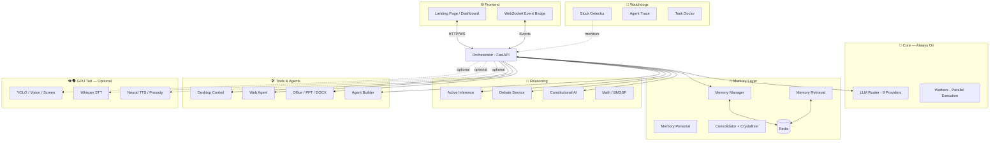

<div align="center">

#  XOYO Omega

**An Autonomous AI Operating System**

[](https://python.org)
[](https://fastapi.tiangolo.com)
[](https://redis.io)
[](LICENSE)

*A modular, self-healing AI system that orchestrates 27 core microservices (expandable to 45+ with GPU hardware) into an autonomous agent that can reason, remember, speak, and act on your computer.*

[Features](#-features) · [Hardware Tiers](#-hardware-tiers) · [Architecture](#%EF%B8%8F-architecture) · [Quick Start](#-quick-start) · [Services](#-service-catalog) · [License](#-license)

</div>

---

## 🌟 What is XOYO?

XOYO Omega is not a chatbot — it is a **full-stack autonomous AI operating system** designed to run locally on commodity hardware. It orchestrates a constellation of specialized microservices into one cohesive agent that can:

- **Think**: Multi-provider LLM routing across 8 providers (Groq, Cerebras, Mistral, NVIDIA NIM, OpenRouter, Cloudflare, SiliconFlow, Ollama) with zero-failure cascading fallback.
- **Remember**: Hierarchical memory system with episodic recall, semantic retrieval, personal context, and automatic consolidation.
- **Reason**: Active Inference, Constitutional AI safety guardrails, and multi-agent debate for complex decisions.
- **Act**: Desktop control, web browsing agent, Google integration, document/presentation generation, and autonomous code writing.
- **Self-Heal**: Watchdog daemon with automatic crash recovery, stuck-task detection, and metacognitive tracing.
- **Perceive** *(GPU tier)*: Computer vision (YOLO, Florence, DINO), screen awareness, wakeword detection.
- **Speak** *(GPU tier)*: Neural TTS with prosody control, Whisper STT, and a full voice pipeline.

---

## ✨ Features

| Category | Capabilities |
|---|---|
| **🧠 Intelligence** | Multi-provider LLM Router (8 providers, cascading fallback), Task-aware model selection, Semantic routing |
| **💾 Memory** | Episodic memory, Semantic retrieval (vector DB), Personal context, Automatic consolidation, Memory crystallization |
| **🔬 Reasoning** | Active Inference engine, Multi-agent debate, BMSSP solver, Math services |
| **🛠️ Tools** | Desktop control, Web/Google agents, Office agent, PPT/DOCX generation, Agent builder |
| **🛡️ Safety** | Constitutional AI guardrails, Flow policy engine, Intent classification (BNN), Permission system |
| **🔄 Self-Healing** | Stuck detector, Agent trace, Task doctor, Interrupt FSM, Auto-restart (3x retry) |
| **👁️ Perception** *(GPU)* | YOLO object detection, Florence/DINO vision, Screen awareness, Wakeword detection |
| **🗣️ Voice** *(GPU)* | Neural TTS, Prosody control, Whisper STT, Affective loop |

---

## 💻 Hardware Tiers

XOYO is designed to **scale to your hardware**. Services are organized into tiers so the system runs well on anything from an ultrabook to a workstation.

| Tier | RAM | GPU | Active Services | What You Get |
|---|---|---|---|---|
| **🟢 Lite** | 8 GB | None | 27 services | Full intelligence, memory, reasoning, tools, safety, and self-healing. All LLM inference is cloud-routed. |
| **🟡 Standard** | 16 GB | None | ~35 services | Everything in Lite + Advanced Idle, Bayesian Surprise, Dreamer, Physics/Materials engines, Deep Research, Scene Generator. |
| **🔴 Full** | 32 GB+ | CUDA GPU | 45+ services | Everything — including local YOLO vision, Florence/DINO perception, Whisper STT, Neural TTS, Prosody, Affective Loop, Wakeword, Mamba, RWKV, and local LLM inference via Ollama/Nitro. |

### How Tier Selection Works

The system uses a `LITE_MODE` flag in `xoyo_daemon.py` and `start_xoyo.sh`. By default, LITE_MODE is **enabled** for safety on low-RAM systems.

```bash
# In xoyo_daemon.py — change this line:
LITE_MODE = True   # Set to False to enable Standard/Full tier services

# Or manually uncomment services in start_xoyo.sh
```

### Tier Breakdown

<details>
<summary><b>🟢 Lite Tier (8 GB RAM, No GPU) — 27 Services</b></summary>

These services run by default on any hardware. All LLM inference is handled by cloud APIs (Groq, Cerebras, Mistral, etc.) — no local GPU needed.

**Core Infrastructure:**
| Service | Description |
|---|---|
| `orchestrator/main.py` | Central FastAPI hub — routes all requests, manages tools |
| `orchestrator/llm_router.py` | Zero-failure routing across 8 LLM providers |
| `services/mythos_os.py` | Unrestricted subsystem controller |
| `services/workers_massive.py` | Parallel task execution engine |

**Intelligence & Reasoning:**
| Service | Description |
|---|---|
| `services/active_inference.py` | Free Energy Principle-based decision making |
| `services/debate_service.py` | Multi-agent adversarial reasoning |
| `services/hyperagents_dgm.py` | Deep Generative Model coordination |
| `services/math_services.py` | Symbolic + numerical computation |
| `services/nngpt_service.py` | Neural network GPT pipeline |
| `services/bmssp_solver.py` | Bounded-Memory Sequential Search |
| `services/diag2diag.py` | Diagnostic reasoning engine |

**Memory:**
| Service | Description |
|---|---|
| `services/memory_manager.py` | Core memory CRUD operations |
| `services/memory_retrieval.py` | Semantic search over memories |
| `services/memory_personal.py` | User preference & context tracking |
| `services/memory_consolidator.py` | Sleep-cycle memory consolidation |
| `services/crystallization_daemon.py` | Converts experiences into reusable skills |

**Safety & Routing:**
| Service | Description |
|---|---|
| `services/constitutional_ai.py` | Ethical guardrails and safety checks |
| `services/intent_bnn.py` | Bayesian Neural Network intent classifier |
| `services/flow_policy.py` | Conversation flow state machine |
| `services/priority_engine.py` | Task prioritization and scheduling |

**Tools & Agents:**
| Service | Description |
|---|---|
| `services/desktop_control.py` | Mouse, keyboard, and window automation |
| `services/web_agent.py` | Autonomous web browsing and research |
| `services/google_agent.py` | Google Workspace integration |
| `services/office_agent.py` | Document editing and management |
| `services/ppt_generator.py` | PowerPoint presentation creation |
| `services/docx_generator.py` | Word document creation |
| `services/xoyo_agent_builder.py` | Create new specialized sub-agents |

**Watchdogs & Monitoring:**
| Service | Description |
|---|---|
| `services/stuck_detector.py` | Detects and recovers hung tasks |
| `services/agent_trace.py` | Full execution tracing and logging |
| `services/task_doctor.py` | Diagnoses and heals failing tasks |
| `services/interrupt_fsm.py` | Finite State Machine for interrupts |
| `services/progress_vocalizer.py` | Announces task progress |
| `services/subagent_supervisor.py` | Manages child agent lifecycles |
| `services/system_monitor.py` | System resource monitoring |
| `services/ws_event_bridge.py` | WebSocket event bridge to frontend |
| `services/activity_stream.py` | Activity logging and streaming |
| `services/voice_pipeline.py` | Voice processing pipeline |

</details>

<details>
<summary><b>🟡 Standard Tier (16 GB RAM, No GPU) — +8 Services</b></summary>

These services add deeper reasoning, scientific simulation, and autonomous exploration. They are lightweight enough to run without a GPU but need more RAM.

| Service | Description | Why Disabled on Lite |
|---|---|---|
| `services/advanced_idle.py` | Autonomous learning during idle time | +200 MB RAM |
| `services/bayesian_surprise.py` | Novelty detection for information gain | +150 MB RAM |
| `services/dreamer_server.py` | World-model based planning | +250 MB RAM |
| `services/physics_server.py` | Physics simulation engine | +150 MB RAM |
| `services/materials_discovery.py` | Materials science computation | +200 MB RAM |
| `services/era_engine.py` | Evolutionary Reasoning Architecture | +150 MB RAM |
| `services/deep_research.py` | Multi-step autonomous research | +200 MB RAM |
| `services/scene_generator.py` | 3D scene composition | +200 MB RAM |

**To enable:** Uncomment these services in `start_xoyo.sh` or set `LITE_MODE = False` in `xoyo_daemon.py`.

</details>

<details>
<summary><b>🔴 Full Tier (32 GB+ RAM, CUDA GPU) — +10 Services</b></summary>

These services load ML models into GPU memory for real-time perception, speech, and local inference. **Requires a CUDA-capable GPU with 6+ GB VRAM.**

| Service | Description | Requirement |
|---|---|---|
| `services/camera_server.py` | Live camera feed processing | GPU + Webcam |
| `services/yolo_server.py` | Real-time YOLOv8 object detection | GPU (2 GB VRAM) |
| `services/vision_server.py` | Multi-model vision routing | GPU (2 GB VRAM) |
| `services/screen_awareness.py` | Screen content understanding | GPU (2 GB VRAM) |
| `services/wakeword_server.py` | Voice activation detection ("Hey XOYO") | GPU (1 GB VRAM) |
| `services/whisper_server.py` | Whisper STT transcription | GPU (2 GB VRAM) |
| `services/neural_tts.py` | Text-to-speech synthesis | GPU (1 GB VRAM) |
| `services/prosody_server.py` | Emotional speech control | GPU (1 GB VRAM) |
| `services/affective_loop.py` | Emotion-aware response adaptation | GPU (1 GB VRAM) |
| `services/memory_advanced.py` | Long-term memory with local embeddings | GPU (2 GB VRAM) |

**Local LLM Inference (Optional):**
| Service | Description | Requirement |
|---|---|---|
| `services/florence_server.py` | Florence-2 vision-language model | GPU (4 GB VRAM) |
| `services/mamba_server.py` | Mamba SSM inference | GPU (4 GB VRAM) |
| `services/rwkv_server.py` | RWKV linear attention model | GPU (4 GB VRAM) |
| `services/nitro_server.py` | Jan.ai Nitro local inference | GPU (6 GB VRAM) |
| `services/llm_server.py` | Generic local LLM endpoint | GPU (6 GB VRAM) |
| `services/smolvla_server.py` | SmolVLA vision-language-action | GPU (4 GB VRAM) |
| `services/dino_server.py` | DINOv2 visual features | GPU (2 GB VRAM) |
| `services/image_generator.py` | AI image generation | GPU (6 GB VRAM) |

**To enable:** Uncomment the desired services in `start_xoyo.sh`. GPU services auto-detect CUDA and will fail gracefully on CPU-only systems.

</details>

---

## 🏗️ Architecture



---

## 🚀 Quick Start

### Prerequisites

- **Python 3.10+**
- **Redis** (for inter-service communication and memory)
- **8 GB+ RAM** (Lite Mode runs 27 services comfortably)
- **CUDA GPU** *(optional — only needed for Full Tier perception/voice)*

### Installation

```bash
# Clone the repository
git clone https://github.com/shashankrpatil077-ctrl/xoyo.git
cd xoyo

# Create virtual environment
python3 -m venv venv
source venv/bin/activate

# Install dependencies
pip install -r requirements.txt

# Configure environment
cp .env.example .env
# Edit .env with your API keys (Groq, Cerebras, Mistral, etc.)
```

### Launch

```bash
# Start all services (Lite Mode — 27 services, safe for 8GB)
./start_xoyo.sh

# Dashboard available at:
# 🌐 http://localhost:9000
```

### Enable More Services

```bash
# For 16GB+ systems — edit start_xoyo.sh and uncomment Standard Tier services
# For 32GB+ GPU systems — uncomment Full Tier services

# Or use the watchdog daemon with LITE_MODE=False:
python xoyo_daemon.py
```

### Shutdown

```bash
./stop_xoyo.sh
```

---

## 🧪 Design Philosophy

1. **Zero-Failure LLM Routing** — Never let a single provider outage kill the system. The LLM Router cascades through 8 providers with automatic retry, rate-limit awareness, and task-aware model selection.

2. **Scale to Your Hardware** — Runs on an 8 GB ultrabook with 27 core services. Uncomment services as your hardware grows. GPU perception and voice services are fully optional.

3. **Microservice Architecture** — Each service is an independent Python process with its own port. Services communicate via Redis pub/sub and HTTP. Any service can crash without taking down the system.

4. **Constitutional Safety** — Every response passes through Constitutional AI guardrails before reaching the user. Destructive actions require explicit permission.

5. **Self-Healing** — The Watchdog Daemon monitors all running services. Crashed services are automatically restarted up to 3 times. Stuck tasks are detected and recovered by the Task Doctor.

---

## 🗂️ Project Structure

```
xoyo/
├── orchestrator/          # Central brain — FastAPI hub + LLM Router
│   ├── main.py            # 2700+ line orchestrator (FastAPI)
│   └── llm_router.py      # Multi-provider LLM routing engine
├── services/              # 45+ independent microservices
│   ├── active_inference.py      # 🟢 Lite
│   ├── constitutional_ai.py     # 🟢 Lite
│   ├── memory_manager.py        # 🟢 Lite
│   ├── web_agent.py             # 🟢 Lite
│   ├── dreamer_server.py        # 🟡 Standard
│   ├── deep_research.py         # 🟡 Standard
│   ├── yolo_server.py           # 🔴 Full (GPU)
│   ├── whisper_server.py        # 🔴 Full (GPU)
│   └── ...
├── frontend/              # Web dashboard & landing page
│   ├── landing.html
│   ├── index.html
│   └── xoyo.js
├── xoyo_daemon.py         # Service watchdog daemon
├── start_xoyo.sh          # Full system launcher (tier-aware)
├── stop_xoyo.sh           # Graceful shutdown
├── self_improve.py        # Autonomous self-improvement loop
└── .env.example           # API key template
```

---

## 📜 License

This project is licensed under the MIT License — see the [LICENSE](LICENSE) file for details.

---

<div align="center">

**Built with obsession by [Shashank R. Patil](https://github.com/shashankrpatil077-ctrl)**

*"The goal isn't to build an AI assistant. It's to build an AI that assists itself."*

</div>
